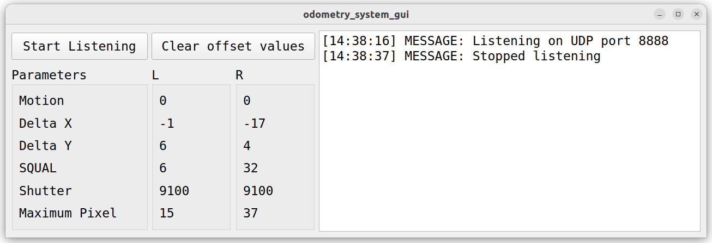

# Система одометрии мобильного робота на основе датчиков оптического потока
### Выпускная квалификационная работа студента группы 233 Савина Никиты. 

___
Графический интерфейс представляет собой сервисное ПО для настройки оптических датчиков.
Микроконтроллер отправляет UDP-датаграммы в порт 8888, и при помощи кнопки "Start Listening"
его можно открыть и получить значения. Кнопкой "Clear offset values" можно очистить выводимые
данные о смещении Delta X и Delta Y.
___
В полях графического интерфейса отображаются следующие значения для левого и правого датчиков:
1) Motion — наличие движения, ноль или единица;
2) Delta X — смещение по оси X;
1) Delta Y — смещение по оси Y;
3) SQUAL — качество поверхности;
4) Shutter — значение выдержки (в тактах);
5) Maximum Pixel — максимальное значение пикселя в кадре.
___
В текстовом поле справа можно увидеть статус прослушивания порта вместе с временной меткой:
1) «[hh:mm:ss] MESSAGE: Listening on UDP port 8888» — в случае успешного подключения к порту 8888,
2) «[hh:mm:ss] MESSAGE: Stopped listening» — при завершении прослушивания,
3) «[hh:mm:ss] ERROR: Failed to bind to port 8888» — в случае ошибки подключения к порту.

